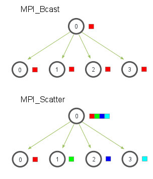
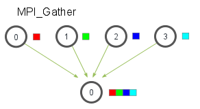
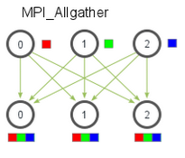
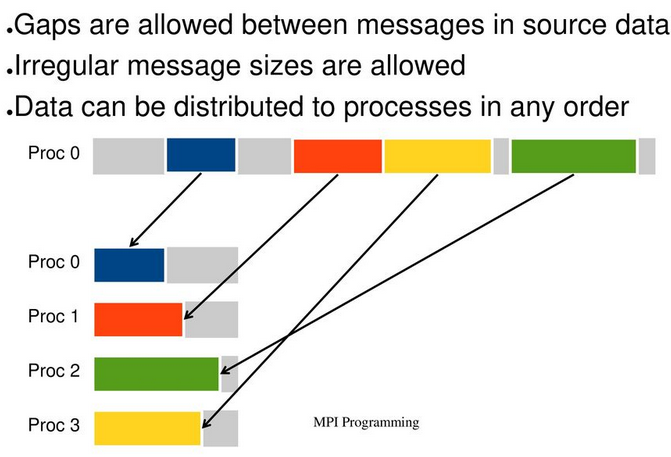
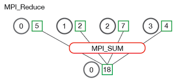
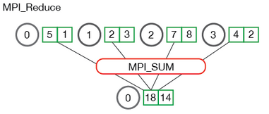
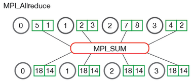

# This is a summary of functions of MPI

You can find good information about this [mpitutorial.com](https://mpitutorial.com/tutorials/mpi-scatter-gather-and-allgather/)
and [mpi-forum](https://www.mpi-forum.org/docs/mpi-1.1/mpi-11-html/node69.html#Node69)

Here I try to explain some of this functions. 
(broadcast=transmision | gather~join~reunir | scatter~dispersar )

## MPI_Bcast

MPI_Bcast is used to broadcast data from one process (tipicaly the root process) to all other processes in the communicator.
MPI_Bcast is a one-to-all communication function. 

~~~
MPI_Bcast(void *buffer, int count, MPI_Datatype datatype, int root, MPI_Comm comm);
~~~
buffer is the data to be broadcast.
count: Number of elements in the buffer.
datatype: The datatype of the elements in the buffer (e.g., MPI_INT, MPI_DOUBLE).
root: The rank of the root process (the one that sends the data).
comm: The communicator over which the broadcast occurs (e.g., MPI_COMM_WORLD).

-- One process (usually the root) has data, and this data needs to be sent to all other processes.

-- After the broadcast, all processes will have the same value in their variable

See the code **Broadcast.cpp**

-- The root process broadcasts a value, and all other processes receive it.

-- After calling MPI_Bcast, the value of broadcast_data is the same across all processes.

-- The function signature is similar to other MPI functions, specifying the data to be broadcast, the number of elements, the data type, the root process, and the communicator.

## MPI_Scatter  

MPI_Scatter is used to distribute chunks (pieces) of data from the root process to all other processes.

~~~
MPI_Scatter(void* send_data, 
    int send_count, 
    MPI_Datatype send_datatype, 
    void* recv_data,
    int recv_count,
    MPI_Datatype recv_datatype,
    int root,
    MPI_Comm communicator)
~~~
If send_count is one and send_datatype is MPI_INT, then process zero gets the first integer of the array, process one
 gets the second integer, and so on. If send_count is two, then process zero gets the first and second integers,
 process one gets the third and fourth, and so on. In practice, send_count is often equal to the number of elements
 in the array divided by the number of processes. If the number of elements isn’t divisible by the number of processes **see**.

 -- The root process has an array of data.
  
 -- Each process will receive a chunk of that array.

See the code **Scatter.cpp**

**Note**: The primary difference between MPI_Bcast and MPI_Scatter is small but important. MPI_Bcast sends the same piece 
of data to all processes while MPI_Scatter sends chunks of an array to different processes.

<!-- BcastVsScatter: Bcast vs Scatter -->

  

## MPI_Gather

MPI_Gather is used when all processes send the same amount of data to the root process.
MPI_Gather is the inverse of MPI_Scatter. Instead of spreading elements from one process to many processes,
MPI_Gather takes elements from many processes and gathers them to one single process.
Similar to MPI_Scatter, MPI_Gather takes elements from each process and gathers them to the root process.
The elements are ordered by the rank of the process from which they were received. 

   

~~~
MPI_Gather(
    void* send_data,
    int send_count,
    MPI_Datatype send_datatype,
    void* recv_data,
    int recv_count,
    MPI_Datatype recv_datatype,
    int root,
    MPI_Comm communicator)
~~~

   -- Each process will send a fixed-size integer (or an array of integers) to the root process (rank 0).
   
   -- The root process will gather these integers and store them in a single array.

See the code **Gather.cpp**:

   -- send_data: Each process sends its rank (an integer) as data.
   
   -- recv_data: The root process (rank 0) gathers the data from all processes into this array.
    
   --  MPI_Gather: Gathers data from all processes. Each process sends 1 integer (send_data),
       and the root process receives all these integers in recv_data.

An example of use Gather and Scatter see **GaScaAverage.cpp** that computes the average across all numbers in an array.
 Although the program is quite simple, it demonstrates how one can use MPI to divide work across processes,
 perform computation on subsets of data, and then aggregate the smaller pieces into the final answer.
 The program takes the following steps:

    Generate a random array of numbers on the root process (process 0).
 
    Scatter the numbers to all processes, giving each process an equal amount of numbers.
 
    Each process computes the average of their subset of the numbers.
 
    Gather all averages to the root process. The root process then computes the average of these numbers to get the final average.

At the beginning of the code, the root process creates an array of random numbers. When MPI_Scatter is called,
 each process now contains elements_per_proc elements of the original data. Each process computes the average of their
 subset of data and then the root process gathers each individual average. The total average is computed on this much smaller array of numbers.

## MPI_Allgather

So far, we have covered two MPI routines that perform many-to-one or one-to-many communication patterns, which simply means 
that many processes send/receive to one process. Oftentimes it is useful to be able to send many elements to many processes 
(i.e. a many-to-many communication pattern). MPI_Allgather has this characteristic.

Given a set of elements distributed across all processes, MPI_Allgather will gather all of the elements to all the processes.
 In the most basic sense, MPI_Allgather is an MPI_Gather followed by an MPI_Bcast. The illustration below shows how data is
 distributed after a call to MPI_Allgather.

   

Just like MPI_Gather, the elements from each process are gathered in order of their rank, except this time the elements are 
gathered to all processes. Pretty easy, right? The function declaration for MPI_Allgather is almost identical to MPI_Gather
with the difference that there is no root process in MPI_Allgather.

~~~
MPI_Allgather(
    void* send_data,
    int send_count,
    MPI_Datatype send_datatype,
    void* recv_data,
    int recv_count,
    MPI_Datatype recv_datatype,
    MPI_Comm communicator)
~~~

**Note:** The size of the data until here is the same for every function. Now to work with differents sizes all the MPI functions has a version
that allows that, we add a **v** to the name of the function for example MPI_Gather -> MPI_Gatherv. 

  

## MPI_Gatherv

MPI_Gatherv is used to gather data from all processes to a root process, but unlike MPI_Gather,
it allows each process to send different amounts of data.

  -- Each process will have an array of integers.
  
  -- The root process (rank 0) will gather these arrays from all processes, but each process
     may send a different number of integers.

See the code called **Gatherv.cpp**:

  -- send_count: Each process calculates how many elements it will send (based on rank).
    
  -- recv_counts: The root process knows how many elements each process will send.
    
  -- displacements: This array tells the root process where to place the received data from each process.
    
  -- MPI_Gatherv: Each process sends send_data to the root process, which stores the data based on recv_counts
       and displacements.

## MPI_Reduce 

Take a look to this tutorial [mpitutorial-reduce-allreduce](https://mpitutorial.com/tutorials/mpi-reduce-and-allreduce/)

MPI_Scatter and MPI_Gather  perform parallel rank computation with MPI. We are going to expand on collective communication
 routines even more in this lesson by going over MPI_Reduce and MPI_Allreduce.

Reduce is a classic concept from functional programming. Data reduction involves reducing a set of numbers into a smaller
 set of numbers via a function. For example, let’s say we have a list of numbers [1, 2, 3, 4, 5]. Reducing this list of numbers
 with the sum function would produce sum([1, 2, 3, 4, 5]) = 15. Similarly, the multiplication reduction would yield multiply([1, 2, 3, 4, 5]) = 120.

As you might have imagined, it can be very cumbersome to apply reduction functions across a set of distributed numbers.
 Along with that, it is difficult to efficiently program non-commutative reductions, i.e. reductions that must occur in a set order.
 Luckily, MPI has a handy function called MPI_Reduce that will handle almost all of the common reductions that a programmer needs
 to do in a parallel application.

Similar to MPI_Gather, MPI_Reduce takes an array of input elements on each process and returns an array of output elements
 to the root process. The output elements contain the reduced result. The prototype for MPI_Reduce looks like this:

~~~
MPI_Reduce(
    void* send_data,
    void* recv_data,
    int count,
    MPI_Datatype datatype,
    MPI_Op op,
    int root,
    MPI_Comm communicator)
~~~
The send_data parameter is an array of elements of type datatype that each process wants to reduce. The recv_data is only relevant
 on the process with a rank of root. The recv_data array contains the reduced result and has a size of sizeof(datatype) * count.
 The op parameter is the operation that you wish to apply to your data. MPI contains a set of common reduction operations that can be used.
 Although custom reduction operations can be defined, it is beyond the scope of this lesson. The reduction operations defined by MPI include:

    MPI_MAX - Returns the maximum element.
    MPI_MIN - Returns the minimum element.
    MPI_SUM - Sums the elements.
    MPI_PROD - Multiplies all elements.
    MPI_LAND - Performs a logical and across the elements.
    MPI_LOR - Performs a logical or across the elements.
    MPI_BAND - Performs a bitwise and across the bits of the elements.
    MPI_BOR - Performs a bitwise or across the bits of the elements.
    MPI_MAXLOC - Returns the maximum value and the rank of the process that owns it.
    MPI_MINLOC - Returns the minimum value and the rank of the process that owns it.

  

In the above, each process contains one integer. MPI_Reduce is called with a root process of 0 and using MPI_SUM as the reduction operation.
 The four numbers are summed to the result and stored on the root process.

It is also useful to see what happens when processes contain multiple elements. The illustration below shows reduction
 of multiple numbers per process.

  

The processes from the above illustration each have two elements. The resulting summation happens on a per-element basis.
 In other words, instead of summing all of the elements from all the arrays into one element, the ith element from each array
 are summed into the ith element in result array of process 0.

Now that you understand how MPI_Reduce looks, we can jump into some code examples.

See **ReduceAverage.cpp**

 Random Number Generation:
   
   The function create_rand_nums creates a vector of random float numbers. It fills the vector with random values normalized between 0 and 1.

 Scattering:
   
   The MPI_Scatter function is used to distribute the vector of random numbers from the root process (rank 0) to all processes.
   Each process receives an equal portion of the numbers stored in local_nums, which is also a vector.

 Local Sum Calculation:
        
   Each process computes the sum of its local subset of random numbers. This is done using a range-based for loop to accumulate the values in local_sum.

 Reduction:

   The MPI_Reduce function combines all local sums into a global sum at the root process. It uses MPI_SUM to sum all local sums together.

 Average Calculation:

  The root process calculates the average by dividing the global sum by the total number of elements processed. It then prints the total sum and average.

 Memory Management:

   In this version, we utilize vectors, which automatically manage memory, so there is no need for manual deallocation.

This code structure simplifies memory management and demonstrates the use of C++ vectors along with MPI functions for distributed computing.

## MPI_Allreduce 

Many parallel applications will require accessing the reduced results across all processes rather than the root process.
 In a similar complementary style of MPI_Allgather to MPI_Gather, MPI_Allreduce will reduce the values and distribute the results to all processes.
 The function prototype is the following:

~~~
MPI_Allreduce(
    void* send_data,
    void* recv_data,
    int count,
    MPI_Datatype datatype,
    MPI_Op op,
    MPI_Comm communicator)
~~~

As you might have noticed, MPI_Allreduce is identical to MPI_Reduce with the exception that it does not need a root
 process id (since the results are distributed to all processes). The following illustrates the communication pattern of MPI_Allreduce:

  

See **AllreduceAverage.cpp**

MPI_Allreduce is the equivalent of doing MPI_Reduce followed by an MPI_Bcast.

### As an example we can compute the standard deviation with MPI_Allreduce

Many computational problems require doing multiple reductions to solve problems. One such problem is finding the standard 
deviation of a distributed set of numbers. For those that may have forgotten, standard deviation is a measure of the dispersion
 of numbers from their mean. A lower standard deviation means that the numbers are closer together and vice versa for higher standard deviations.

To find the standard deviation, one must first compute the average of all numbers. After the average is computed, the sums of the
 squared difference from the mean are computed. The square root of the average of the sums is the final result.
 Given the problem description, we know there will be at least two sums of all the numbers, translating into two reductions.
 An excerpt from reduce_stddev.c in the lesson code shows what this looks like in MPI.

See **StandarDeviation.cpp**

 Random Number Generation:
 
   Create_rand_nums generates a vector of random numbers (floats between 0 and 1) for each process.

 Local Sum Calculation:
 
   Each process calculates the sum of its portion of the random numbers and stores it in local_sum.

 Global Mean Calculation:

  MPI_Allreduce is used to sum the local_sum values from all processes to compute the global sum, which is then used to calculate the mean.
  This result is broadcast to all processes.

 Local Sum of Squared Differences:

  Each process computes the sum of squared differences from the global mean (local_sq_diff).

 Global Sum of Squared Differences:

  Another MPI_Allreduce is used to sum the local squared differences (local_sq_diff) from all processes, resulting in the global
  sum of squared differences.

 Standard Deviation Calculation:

  The standard deviation is calculated by taking the square root of the average of the squared differences. Since MPI_Allreduce is used,
  each process can compute and print the global mean and standard deviation independently.

This code uses vectors to handle data and MPI_Allreduce to ensure that all processes receive the necessary global results.

## Next step see Communicators

Take a look in [Cominucators](https://mpitutorial.com/tutorials/introduction-to-groups-and-communicators/)

